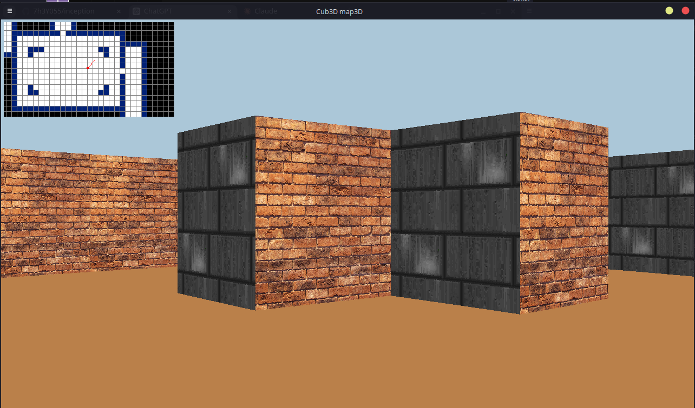

# Cub3D

## Overview

Cub3D is a 3D raycasting engine developed as part of the curriculum at 42. This project aims to deepen understanding of graphics programming, algorithm implementation, and the basics of game development using C.

## Table of Contents

- [Features](#features)
- [Installation](#installation)
- [Usage](#usage)
- [Controls](#controls)
- [Screenshots](#screenshots)
- [License](#license)

## Features

- Raycasting engine for 2D and 3D rendering.
- Dynamic map loading and rendering.
- Player movement and view control.
- Textures and sprite handling.
- Basic game mechanics such as collision detection.
- Handle All Textures Sizes.
- Ubunga Follow you 😂
- Jump
- Mouse

## Installation

To get started with Cub3D, follow these steps:


1.  **Install MLX**:
    - Install dependencies:
    bash```
        sudo apt-get update
        sudo apt-get install libx11-dev libxext-dev libbsd-dev
    ```
    - Download MinilibX:
    bash```
        git clone https://github.com/42Paris/minilibx-linux.git
    ```

    - Navigate to the downloaded directory:
    bash```
        cd minilibx-linux
    ```

    - Compile the library:
    bash```
        make
    ```

    - Install the library:
    bash```
        sudo cp mlx.h /usr/include
        sudo cp libmlx.a /usr/lib
    ```

1. **Clone the Repository**:

   ```bash
    git clone https://github.com/yourusername/cub3d.git
    cd cub3d
    ```


2.  **Usage**

    bash```
        ./cub3D maps/big.map
        ```

3.  **Controls***

    - W: Move Forward
    - S: Move Backward
    - A: Strafe Left
    - D: Strafe Right
    - Arrow Keys OR Mouse: Look Around
    - ESC: Exit

4.  **Screenshots**

    


5.  **License**
    - Feel free to modify and expand this template to suit your project's specific features and requirements!


